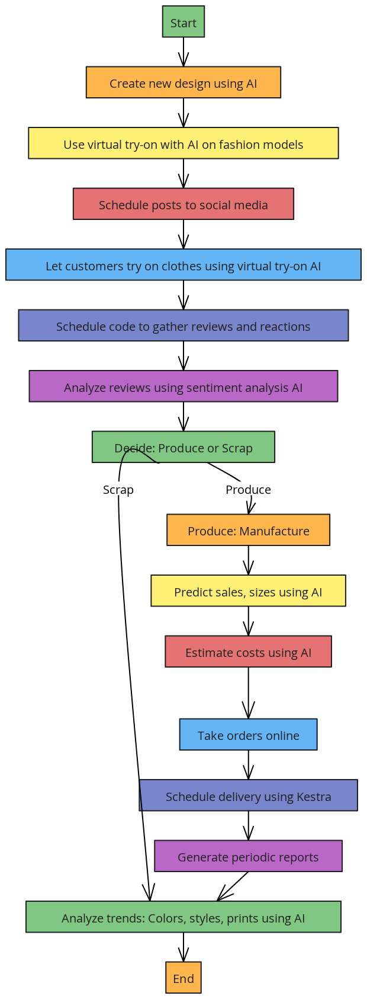
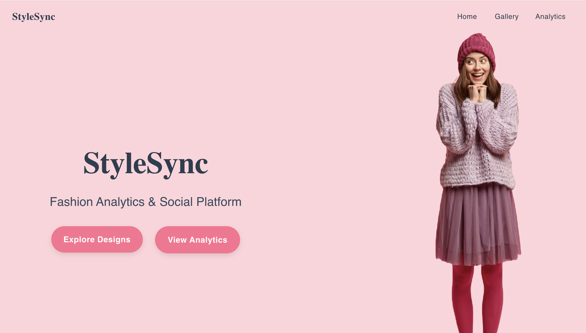
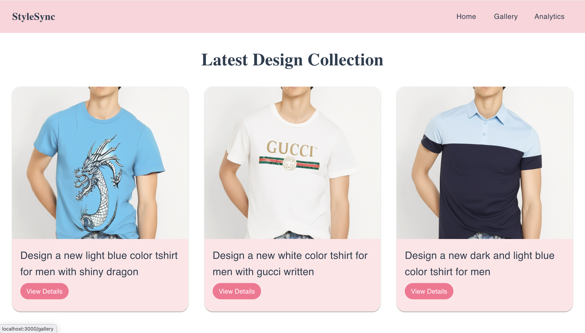

# StyleSync (Automating T-Shirt Brand with Kestra & AI)

## Overview

Our project is all about simplifying how t-shirt brands work by automating key processes using Kestra and AI. We use Kestra to trigger the generation of unique t-shirt designs, perform virtual try-ons, and automate product listings and promotions on social media and our e-commerce website. 

The project is divided into two main parts:
- **Frontend**: Built with React to provide a sleek, interactive user interface.
- **Backend**: Powered by FastAPI to handle API requests, communicate with the database, and manage automation.
- **Automation**: Kestra orchestrates the workflow, connecting all processes together to make everything run smoothly.

## Features

- **Automatic T-shirt Design Generation**: New t-shirt designs are created using Stable Diffusion triggered through Kestra.
- **Virtual Try-Ons**: Users can try on t-shirts using a custom-built AI model that realistically displays t-shirts on a virtual model.
- **Product Listing and Promotion**: Automatically posts new t-shirt designs to social media platforms and e-commerce sites.
- **AI Feedback Analysis**: Future plans to analyze customer feedback on designs to generate new designs based on preferences and trends.

## Tech Stack

- **Frontend**: React
- **Backend**: FastAPI
- **Automation**: Kestra
- **AI/Design Generation**: Stable Diffusion, Custom AI Model for Virtual Try-Ons
- **Database**: SQLite
- **Cloud Integration**: Cloudinary for image hosting


## System Block Diagram 


## Demo

  

StyleSync demo [here](https://youtu.be/zR-WOvql-38?si=JTMRm8WVT6v6RVny)

## Installation

### 1. Clone the Repository
```bash
git clone https://github.com/Sadhana-Panthi/StyleSync.git
```


## Backend Setup (FastAPI)
### 1. Navigate to the backend directory:
```bash
cd backend
```
### 2. Install dependencies:
```bash
pip install -r requirements.txt
```
### 3. Run the FastAPI server:
```bash
uvicorn main:app --reload
```

## Frontend Setup (React)
### 1. Navigate to the frontend directory:
```bash
cd frontend
```
### 2. Install dependencies:
```bash
npm install
```
### 3. Start the React development server:

```bash
npm start
```
## Kestra Setup
- Set up Kestra to automate the workflow by configuring the appropriate Python scripts and triggering mechanisms.
- Ensure that Kestra is connected to the backend APIs for generating designs and updating listings.
### kestra in YAML format in the code : [code](https://github.com/Sadhana-Panthi/StyleSync/blob/main/backend/gen_design.yml)


